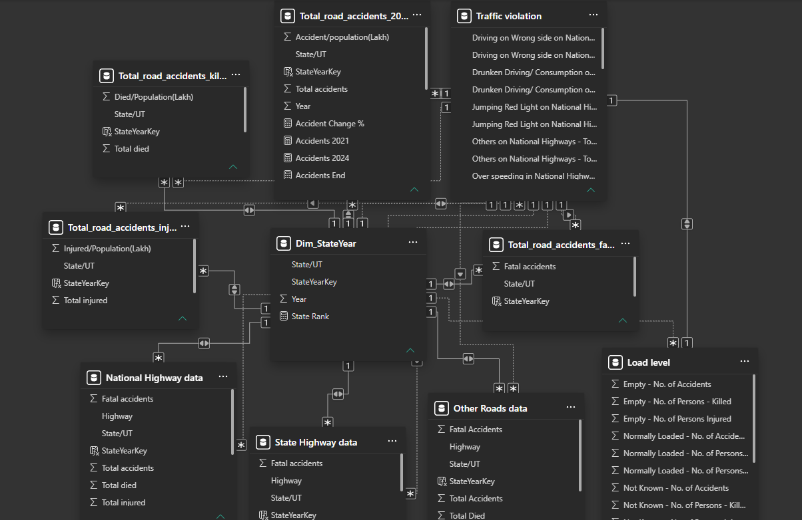
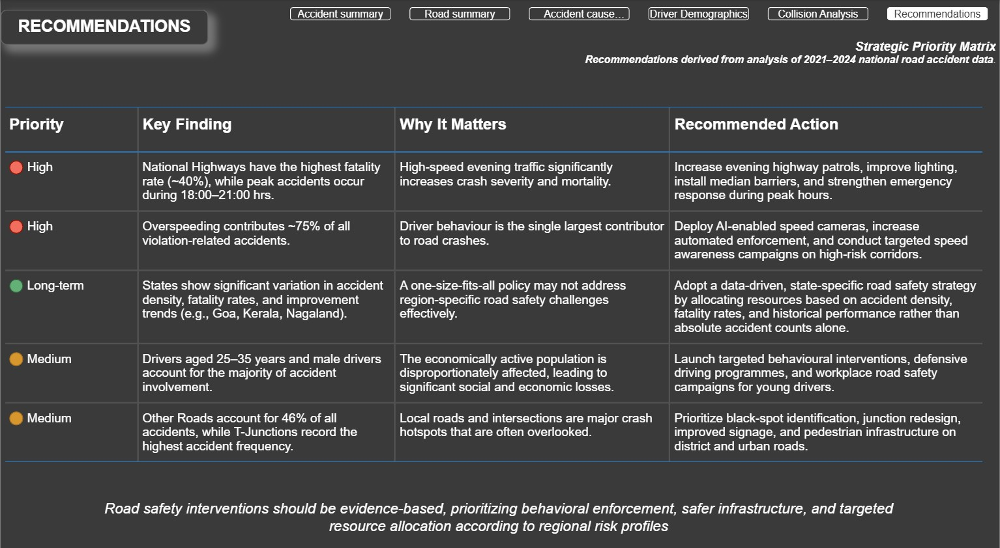

# Road-Accident-Analysis-India
## Power BI | SQL | Excel | Power Query | DAX | Data Visualization

### Project Overview:
Road accidents remain one of India's most critical public safety challenges, leading to significant loss of life and economic productivity each year. This project analyzes national road accident data from 2021–2024 to uncover trends, identify high-risk regions, and examine behavioural, infrastructural, demographic, and environmental factors contributing to accidents.

The project follows a complete Business Intelligence workflow—from raw Excel datasets to an interactive Power BI dashboard—culminating in data-driven policy recommendations aimed at improving road safety.

### Business Objective:
The objectives of this project are to:

- Analyze national road accident trends across Indian states
- Identify accident hotspots using both absolute and population-adjusted metrics
- Understand key causes contributing to road accidents
- Analyze driver demographics and licensing patterns
- Evaluate the impact of road type, weather, time of day, and junction design
- Provide actionable, data-driven recommendations for policymakers

### Tech Stack:
| Tool | Purpose |
|------|---------|
|Microsoft Excel|Initial data inspection|
|Power Query|Data cleaning & transformation|
|SQL	|Data querying & analysis|
|Power BI	|Dashboard development|
|DAX	|KPI calculations & dynamic measures|

### Source:
[Ministry of Road Transport & Highways (MoRTH), Government of India]( https://www.data.gov.in/catalog/road-accidents-india-2024?page=2 )

#### Data Coverage:
- Road Accidents (2021–2024)
- Fatal Accidents
- Fatalities
- Road Type
- Traffic Violations
- Driver Age & Gender
- Driving Licence Status
- Collision Type
- Junction Type
- Weather Conditions
- Vehicle Load Condition
- Time of Accident

### Data Preparation and Modelling
A significant portion of this project was dedicated to data preparation and modeling to ensure accuracy, consistency, and usability across all dashboards. The raw datasets required extensive cleaning and transformation before they could be effectively analyzed.

Unnecessary and redundant columns were removed to streamline the datasets and improve performance. Data types were standardized across all tables to maintain consistency, and missing or inconsistent values were handled to ensure data reliability.

Primary keys were generated for each table to uniquely identify records, enabling accurate relationships between datasets. A well-structured star schema was designed, with a central fact table connected to multiple dimension tables such as customers, merchants, transactions, and time. This structure ensured efficient querying, scalability, and seamless integration within Power BI.

Additionally, data normalization and standardization were applied to maintain uniform formats across attributes like transaction types, merchant categories, and customer segments. These steps were critical in enabling accurate aggregations, filtering, and cross-dashboard analysis.

Overall, the data preparation phase laid a strong foundation for the entire project, ensuring that all insights and visualizations are built on clean, structured, and reliable data.

The raw datasets required extensive preprocessing before analysis.

### Data Cleaning
- Removed inconsistencies and duplicate records
- Standardised state names
- Handled missing values
- Converted wide-format datasets into analytical tables using Unpivot
- Created calculated fields for accident density and mortality rates
- Data Modelling

### Implemented a Star Schema:

### Dashboard Overview:

#### Executive Summary
- Provides a high-level overview of national accident trends.

#### Road Infrastructure Analysis
- Focuses on accident distribution across road categories.

#### Accident Cause Analysis
- Analyzes behavioural and vehicle-related causes.

#### Driver Demographics
- Examines demographic characteristics of drivers and victims.

#### Road & Environmental Analysis
- Analyzes accident patterns based on external conditions. 

#### Strategic Recommendations
- Transforms analytical insights into prioritized, actionable policy recommendations.

